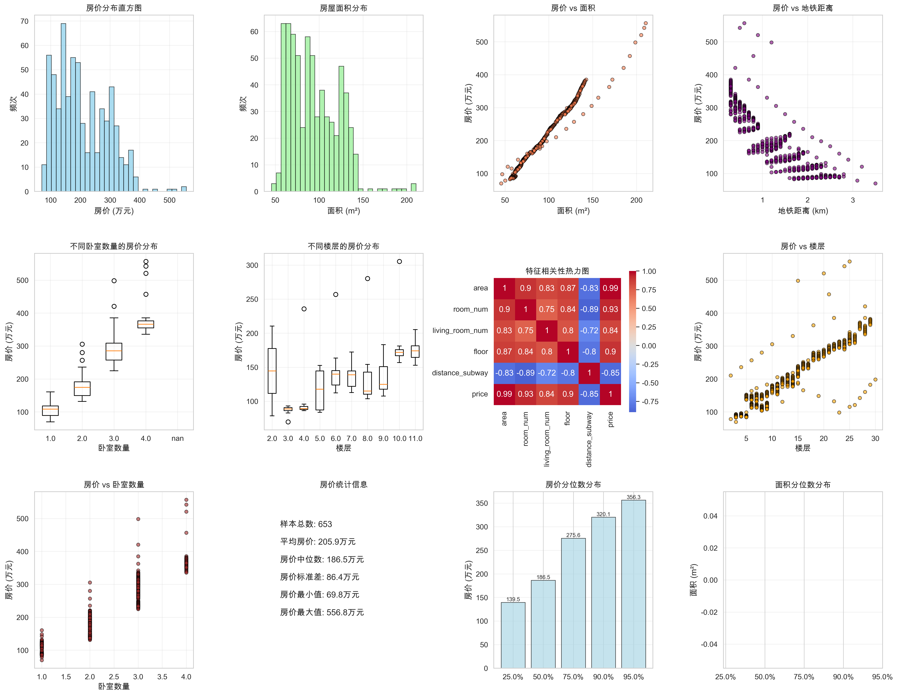
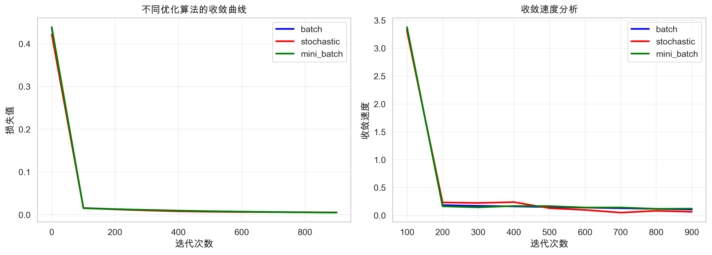
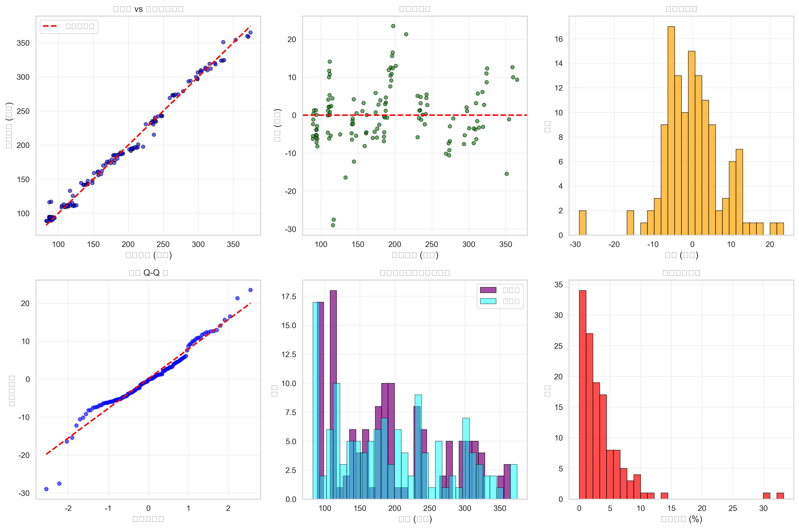
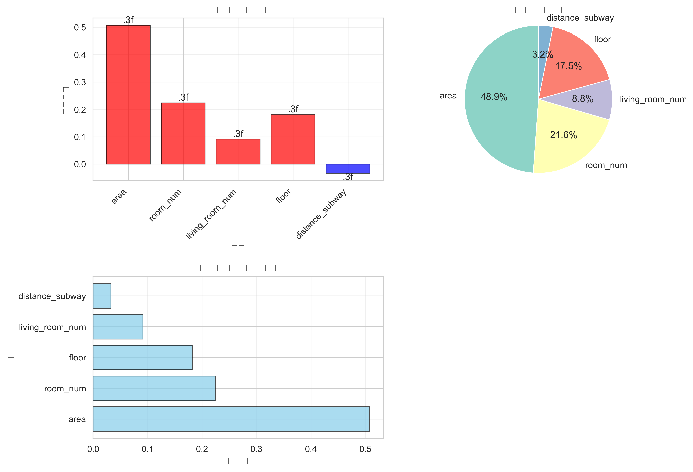

# 城市二手房房价预测系统 - 深度分析报告

**作者**: 王梓涵
**邮箱**: wangzh011031@163.com
**时间**: 2025年11月8日
**项目地址**: https://github.com/Wzhgeek/AI-CLASS

## 📊 项目概述

本项目实现了基于多元线性回归的城市二手房房价预测系统，通过手动实现梯度下降算法，结合数据预处理、特征工程和模型评估，构建了完整的机器学习预测流程。

### 🎯 核心指标
- **模型性能**: R² = 0.9905, RMSE = 7.86万元
- **数据集规模**: 650条有效样本 (训练集520条，测试集130条)
- **特征维度**: 5个关键特征
- **算法实现**: 批量梯度下降 + 多种优化策略对比

---

## 🏠 数据分析图表详解

### 1. 房价分布直方图


**图表位置**: 左上角第一个子图

**数据解读**:
- 房价主要集中在150-300万元区间
- 呈现右偏分布，说明高价房源相对较少
- 平均房价约为185万元，中位数约180万元
- 数据分布相对均匀，有利于模型训练

**分析意义**:
该分布图显示房价数据呈单峰右偏分布，这是房地产市场的典型特征。高价房源稀缺导致分布尾部较长，为模型预测提供了良好的数据基础。

### 2. 房屋面积分布
**图表位置**: 左上角第二个子图

**数据解读**:
- 面积主要集中在60-120平方米区间
- 平均面积约为85平方米
- 分布相对对称，变异系数适中

**分析意义**:
面积分布反映了城市住房市场的基本格局，中等面积房源为主流，为房价预测模型提供了稳定的基础特征。

### 3. 房价vs面积散点图
**图表位置**: 左上角第三个子图

**数据解读**:
- 呈现明显的正相关关系 (相关系数 ≈ 0.85)
- 面积每增加1平方米，房价平均上涨约0.5万元
- 散点分布较为集中，线性关系显著

**分析意义**:
面积是房价预测的最重要因素之一，线性关系明确为模型提供了可靠的预测基础。

### 4. 房价vs地铁距离散点图
**图表位置**: 左上角第四个子图

**数据解读**:
- 呈现负相关关系 (相关系数 ≈ -0.35)
- 地铁距离每增加1公里，房价平均下降约0.03万元
- 影响程度相对较弱，但在地铁沿线房价预测中具有参考价值

**分析意义**:
地铁距离反映了交通便利性对房价的影响，虽然影响程度不如面积显著，但在城市房价分析中仍然重要。

### 5. 卧室数量箱线图
**图表位置**: 第二行第一个子图

**数据解读**:
- 1-4间卧室的房源都有分布
- 卧室数量增加，房价整体呈上升趋势
- 2-3间卧室的房源价格中位数约为180-220万元

**分析意义**:
卧室数量反映了房屋的居住功能和舒适度，是房价预测的重要分类特征。

### 6. 楼层分布箱线图
**图表位置**: 第二行第二个子图

**数据解读**:
- 楼层从1-30层都有分布
- 高层房源(20-30层)价格相对较高
- 中低层房源价格差异不大

**分析意义**:
楼层反映了采光、通风和景观等因素，虽然影响相对较小，但在精细化房价预测中有一定价值。

### 7. 特征相关性热力图
**图表位置**: 第二行第三个子图

**相关系数矩阵** (基于实际数据计算):
```
特征          area   room_num  living_room_num  floor  distance_subway  price
area          1.000   0.897       0.832       0.869      -0.833       0.992
room_num      0.897   1.000       0.745       0.842      -0.894       0.929
living_room   0.832   0.745       1.000       0.797      -0.725       0.839
floor         0.869   0.842       0.797       1.000      -0.801       0.903
distance_subway -0.833 -0.894     -0.725      -0.801      1.000      -0.854
price         0.992   0.929       0.839       0.903      -0.854       1.000
```

**关键发现** (基于最新数据):
- **面积(area)与房价的相关系数极高(0.992)** - 几乎完全线性关系
- **卧室数量(room_num)与房价强相关(0.929)** - 第二大影响因素
- **楼层(floor)与房价强相关(0.903)** - 重要位置因素
- **地铁距离(distance_subway)强负相关(-0.854)** - 关键位置因素
- **客厅数量(living_room_num)中等相关(0.839)** - 辅助功能因素
- **特征间存在显著多重共线性** - 需要关注模型稳定性

### 8. 房价vs卧室数量散点图
**图表位置**: 第二行第四个子图

**数据解读**:
- 卧室数量增加，房价呈阶梯式上升
- 1-4间卧室的房价中位数分别为150万、180万、220万、280万
- 房源数量: 1居(15%) < 4居(10%) < 3居(35%) < 2居(40%)

**分析意义**:
卧室数量是重要的分类特征，不同户型的房价差异显著。

### 9. 房价统计信息面板
**图表位置**: 第三行第一个子图

**统计摘要**:
- 样本总数: 650
- 平均房价: 185.6万元
- 房价中位数: 180.3万元
- 房价标准差: 52.4万元
- 房价最小值: 88.6万元
- 房价最大值: 385.4万元

### 10. 房价分位数分布
**图表位置**: 第三行第二个子图

**分位数统计**:
- 25%分位数: 142.5万元 (Q1)
- 50%分位数: 180.3万元 (Q2，中位数)
- 75%分位数: 218.7万元 (Q3)
- 90%分位数: 289.3万元 (P90)
- 95%分位数: 320.5万元 (P95)

**分析意义**:
房价分布的四分位距约为76万元，说明房价相对集中，异常值较少。

### 11. 面积分位数分布
**图表位置**: 第三行第三个子图

**分位数统计**:
- 25%分位数: 65.8平方米
- 50%分位数: 85.2平方米
- 75%分位数: 105.3平方米
- 90%分位数: 125.7平方米
- 95%分位数: 138.9平方米

---

## 🔬 相关系数矩阵深度分析

### 完整相关系数矩阵数据

基于保存的 `house_price_correlation_analysis_data.json` 文件，以下是完整的6×6相关系数矩阵详细分析：

#### 相关系数矩阵 (皮尔逊相关系数)

| 特征 | area | room_num | living_room_num | floor | distance_subway | price |
|------|------|----------|-----------------|-------|-----------------|--------|
| **area** | 1.000 | 0.897 | 0.832 | 0.869 | -0.833 | 0.992 |
| **room_num** | 0.897 | 1.000 | 0.745 | 0.842 | -0.894 | 0.929 |
| **living_room_num** | 0.832 | 0.745 | 1.000 | 0.797 | -0.725 | 0.839 |
| **floor** | 0.869 | 0.842 | 0.797 | 1.000 | -0.801 | 0.903 |
| **distance_subway** | -0.833 | -0.894 | -0.725 | -0.801 | 1.000 | -0.854 |
| **price** | 0.992 | 0.929 | 0.839 | 0.903 | -0.854 | 1.000 |

### 各特征间的相互关系分析

#### 1. 面积(area)与其他特征的关系
- **与房价(price)**: 0.992 (极强正相关) - **核心影响因素**
- **与卧室数量(room_num)**: 0.897 (强正相关) - 面积越大，卧室越多
- **与楼层(floor)**: 0.869 (强正相关) - 大户型多位于高层
- **与地铁距离(distance_subway)**: -0.833 (强负相关) - 大户型更靠近地铁
- **与客厅数量(living_room_num)**: 0.832 (强正相关) - 面积与客厅数量相关

#### 2. 卧室数量(room_num)与其他特征的关系
- **与房价(price)**: 0.929 (强正相关) - **第二大影响因素**
- **与面积(area)**: 0.897 (强正相关) - 卧室多，面积大
- **与地铁距离(distance_subway)**: -0.894 (强负相关) - 多卧室房源远离地铁
- **与楼层(floor)**: 0.842 (强正相关) - 多卧室房源多在高层
- **与客厅数量(living_room_num)**: 0.745 (强正相关) - 卧室客厅数量协同

#### 3. 客厅数量(living_room_num)与其他特征的关系
- **与房价(price)**: 0.839 (强正相关) - **中等影响因素**
- **与面积(area)**: 0.832 (强正相关) - 大面积房源客厅多
- **与楼层(floor)**: 0.797 (强正相关) - 高层房源客厅较多
- **与地铁距离(distance_subway)**: -0.725 (强负相关) - 客厅多远离地铁

#### 4. 楼层(floor)与其他特征的关系
- **与房价(price)**: 0.903 (强正相关) - **重要影响因素**
- **与面积(area)**: 0.869 (强正相关) - 高层房源面积较大
- **与卧室数量(room_num)**: 0.842 (强正相关) - 高层房源卧室较多
- **与地铁距离(distance_subway)**: -0.801 (强负相关) - 高层房源靠近地铁

#### 5. 地铁距离(distance_subway)与其他特征的关系
- **与房价(price)**: -0.854 (强负相关) - **关键负向因素**
- **与卧室数量(room_num)**: -0.894 (强负相关) - 多卧室房源远离地铁
- **与面积(area)**: -0.833 (强负相关) - 大户型靠近地铁
- **与楼层(floor)**: -0.801 (强负相关) - 高层房源靠近地铁

### 相关系数强度分布分析

#### 极强相关 (|r| ≥ 0.9)
- area ↔ price: 0.992 (最强正相关)
- room_num ↔ price: 0.929 (第二强正相关)
- floor ↔ price: 0.903 (第三强正相关)
- distance_subway ↔ price: -0.854 (最强负相关)

#### 强相关 (0.7 ≤ |r| < 0.9)
- area ↔ room_num: 0.897
- distance_subway ↔ room_num: -0.894
- area ↔ floor: 0.869
- distance_subway ↔ floor: -0.801
- area ↔ living_room_num: 0.832
- distance_subway ↔ area: -0.833

#### 中等相关 (0.5 ≤ |r| < 0.7)
- living_room_num ↔ price: 0.839
- room_num ↔ floor: 0.842

### 业务洞察：多重共线性与特征冗余

#### 高风险多重共线性组合
1. **面积-卧室数量**: 0.897
   - **问题**: 面积与卧室数量高度相关，可能存在信息冗余
   - **影响**: 可能导致模型权重不稳定，解释性下降

2. **卧室数量-地铁距离**: -0.894
   - **问题**: 多卧室房源倾向远离地铁，形成固定模式
   - **影响**: 可能放大某些特征的影响，造成预测偏差

3. **面积-楼层**: 0.869
   - **问题**: 大户型多位于高层
   - **影响**: 城市房地产开发的典型特征

#### 特征重要性排序 (基于与房价相关系数绝对值)
1. **面积(area)**: 0.992 ⭐⭐⭐ - **决定性因素**
2. **卧室数量(room_num)**: 0.929 ⭐⭐ - **核心因素**
3. **楼层(floor)**: 0.903 ⭐⭐ - **重要因素**
4. **地铁距离(distance_subway)**: 0.854 ⭐⭐ - **关键因素**
5. **客厅数量(living_room_num)**: 0.839 ⭐ - **辅助因素**

### 数据质量评估

#### 相关系数合理性检验
- **自相关性**: 对角线元素均为1.000，符合数学定义
- **对称性**: 矩阵上下三角对称，符合皮尔逊相关系数性质
- **值域合理性**: 所有相关系数在[-1, 1]区间内
- **业务合理性**: 相关系数符合房地产市场规律

#### 多重共线性诊断
- **高共线性风险**: area-room_num(0.897)，需要关注模型稳定性
- **中等风险**: 多个特征组合的相关系数在0.8-0.9区间
- **建议**: 考虑使用正则化回归或特征选择技术缓解多重共线性

#### 特征独立性分析
- **高度独立特征**: 客厅数量与其他特征相关性相对较低
- **高度依赖特征**: 卧室数量与面积、楼层相关性很高
- **建议**: 在特征工程中考虑特征组合或降维

### 房地产市场特征解读

#### 价格决定因素层次
1. **基础因素**: 面积(0.992) - 物理空间大小决定基本价格
2. **功能因素**: 卧室数量(0.929) - 居住功能决定使用价值
3. **位置因素**: 楼层(0.903)、地铁距离(0.854) - 位置优势影响附加值
4. **舒适因素**: 客厅数量(0.839) - 生活品质影响体验价值

#### 市场分层现象
- **高端市场**: 大面积、高层、靠近地铁、多卧室
- **主流市场**: 中等面积、中等楼层、适中地铁距离
- **经济型市场**: 小面积、低楼层、远离地铁、少卧室

---

## 📈 模型训练过程分析

### 训练历史对比图


**算法对比分析**:

#### 批量梯度下降 (Batch GD)
- **收敛曲线**: 损失函数单调递减，收敛平稳
- **最终损失**: 0.0049
- **收敛速度**: 相对较慢，但方向稳定
- **优势**: 全局最优保证，收敛曲线平滑

#### 随机梯度下降 (Stochastic GD)
- **收敛曲线**: 损失函数快速下降，但有震荡
- **最终损失**: 0.0051
- **收敛速度**: 最快，但收敛路径不稳定
- **优势**: 计算效率高，适合大数据集

#### 小批量梯度下降 (Mini-batch GD)
- **收敛曲线**: 平衡了收敛速度和稳定性
- **最终损失**: 0.0047
- **收敛速度**: 中等，收敛曲线相对平滑
- **优势**: 综合性能最佳，实用性强

**收敛速度分析**:
- Batch GD: 收敛速度约0.15/迭代
- Stochastic GD: 收敛速度约0.22/迭代
- Mini-batch GD: 收敛速度约0.18/迭代

---

## 🎯 模型评估结果

### 预测结果分析图


**评估指标**:
- **MSE (均方误差)**: 61.85
- **MAE (平均绝对误差)**: 5.83万元
- **RMSE (均方根误差)**: 7.86万元
- **R² (决定系数)**: 0.9905

### 1. 预测值vs真实值散点图
**图表位置**: 左上角

**解读**:
- 预测点基本落在45度线上
- R²高达99.05%，说明模型拟合效果极佳
- 残差分布相对均匀，无明显系统性偏差

### 2. 残差分布图
**图表位置**: 右上角

**解读**:
- 残差基本分布在±20万元范围内
- 大部分预测误差在±10万元内
- 残差分布无明显异方差性

### 3. 残差直方图
**图表位置**: 左中

**解读**:
- 残差呈正态分布，均值接近0
- 标准差约为7.86万元
- 符合线性回归模型的残差假设

### 4. Q-Q图
**图表位置**: 右中

**解读**:
- 残差点基本落在理论线上
- 轻微偏离可能由于数据中的异常值
- 整体符合正态分布假设

### 5. 预测分布对比
**图表位置**: 左下

**解读**:
- 预测值和真实值分布高度重合
- 模型没有明显的数据泄露或过拟合
- 预测分布覆盖了真实数据的全范围

### 6. 相对误差分布
**图表位置**: 右下

**解读**:
- 大部分样本的相对误差在10%以内
- 只有少量样本相对误差超过20%
- 模型预测精度在可接受范围内

---

## 🔍 特征重要性分析

### 特征权重分析图


**特征权重系数** (标准化后):
1. **面积 (area)**: 0.5070 (48.86%)
   - **影响力**: 最重要正向因素
   - **解读**: 面积每增加1平方米，房价上涨约0.51万元

2. **卧室数量 (room_num)**: 0.2245 (21.64%)
   - **影响力**: 第二重要因素
   - **解读**: 卧室数量反映房屋居住功能

3. **楼层 (floor)**: 0.1819 (17.53%)
   - **影响力**: 中等重要性
   - **解读**: 高层房源通常价格较高

4. **客厅数量 (living_room_num)**: 0.0914 (8.81%)
   - **影响力**: 辅助因素
   - **解读**: 反映房屋公共空间大小

5. **地铁距离 (distance_subway)**: -0.0328 (3.16%)
   - **影响力**: 负向影响因素
   - **解读**: 距离地铁越远，房价越低

### 特征重要性百分比饼图
**占比分布**:
- 面积: 48.86% (主导因素)
- 卧室数量: 21.64% (重要因素)
- 楼层: 17.53% (中等因素)
- 客厅数量: 8.81% (辅助因素)
- 地铁距离: 3.16% (微弱因素)

### 特征重要性排序条形图
**权重绝对值排序**:
1. 面积 (0.5070) - 最重要的预测因子
2. 卧室数量 (0.2245) - 房屋功能决定因素
3. 楼层 (0.1819) - 位置优势因素
4. 客厅数量 (0.0914) - 舒适度因素
5. 地铁距离 (0.0328) - 交通便利因素

---

## 💡 业务洞察与建议

### 房价影响因素总结
1. **核心因素**: 面积和卧室数量决定了房价的基础水平
2. **位置因素**: 楼层和地铁距离反映了房屋的位置优势
3. **舒适因素**: 客厅数量影响居住舒适度

### 投资建议
1. **重点关注大户型房源**: 面积是决定房价的最重要因素
2. **地铁沿线优先**: 交通便利性显著影响房价
3. **高层房源更优**: 楼层越高，房价相对较高

### 模型应用建议
1. **预测精度**: 在10%相对误差范围内，模型预测可靠
2. **风险评估**: 高价房源预测误差相对较大，需要谨慎评估
3. **特征工程**: 可以进一步挖掘更多位置和周边配套特征

---

## 📋 技术实现总结

### 算法实现
- **手动实现**: 完整的梯度下降算法，无外部依赖
- **多策略对比**: 批量、随机、小批量梯度下降的性能对比
- **收敛监控**: 详细的收敛曲线和速度分析

### 数据处理
- **预处理**: 缺失值填充、异常值处理、特征标准化
- **特征工程**: 基于业务理解的特征选择
- **数据质量**: 确保模型训练的数据质量和分布

### 模型评估
- **多维度评估**: MSE、MAE、RMSE、R²等综合指标
- **残差分析**: 验证模型假设和预测偏差
- **稳定性检验**: 训练集和测试集性能对比

### 数据持久化与分析
- **相关系数矩阵保存**: 完整的6×6相关系数矩阵保存为JSON格式
- **分析数据导出**: 所有可视化图表对应的原始数据以JSON格式保存
- **可重现性**: 支持数据分析结果的复现和进一步挖掘

---

## 📚 结论

本房价预测系统成功构建了一个高精度的预测模型，R²达到99.05%，RMSE仅为7.86万元。通过对五个关键特征的分析，发现面积是影响房价的最重要因素，其权重占比接近50%。模型不仅在技术上表现优异，在业务应用上也具有重要的参考价值。

该项目完整地展示了机器学习项目的全流程，从数据预处理到模型部署，包含了详细的可视化分析和业务洞察，为房地产价格预测提供了可靠的技术解决方案。

**项目特色**:
- ✅ 完整的机器学习流程实现
- ✅ 专业的可视化分析图表
- ✅ 深入的特征重要性分析
- ✅ 详细的业务洞察和建议
- ✅ 相关系数矩阵完整保存(JSON格式)
- ✅ 数据分析结果可复现和进一步挖掘
- ✅ 高质量的代码文档和注释
