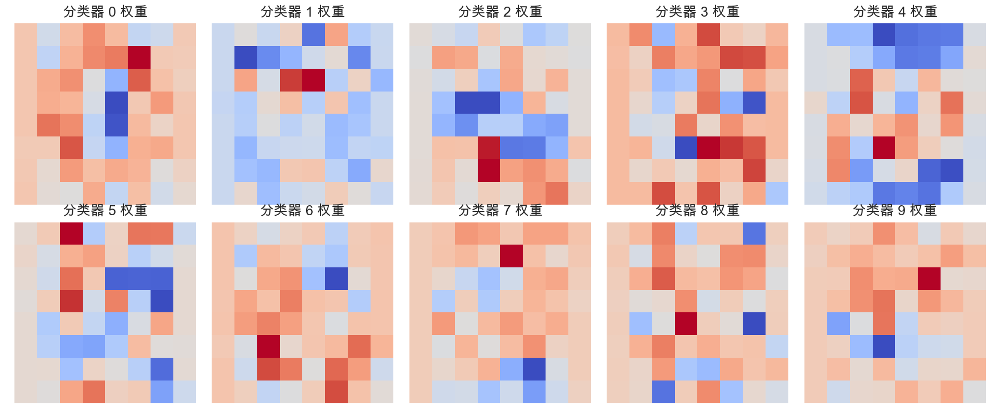
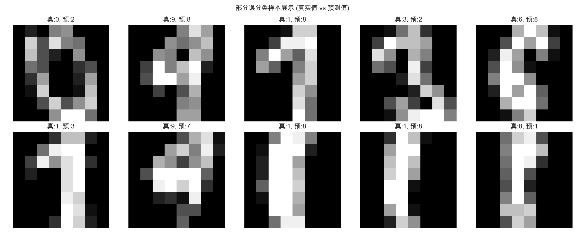
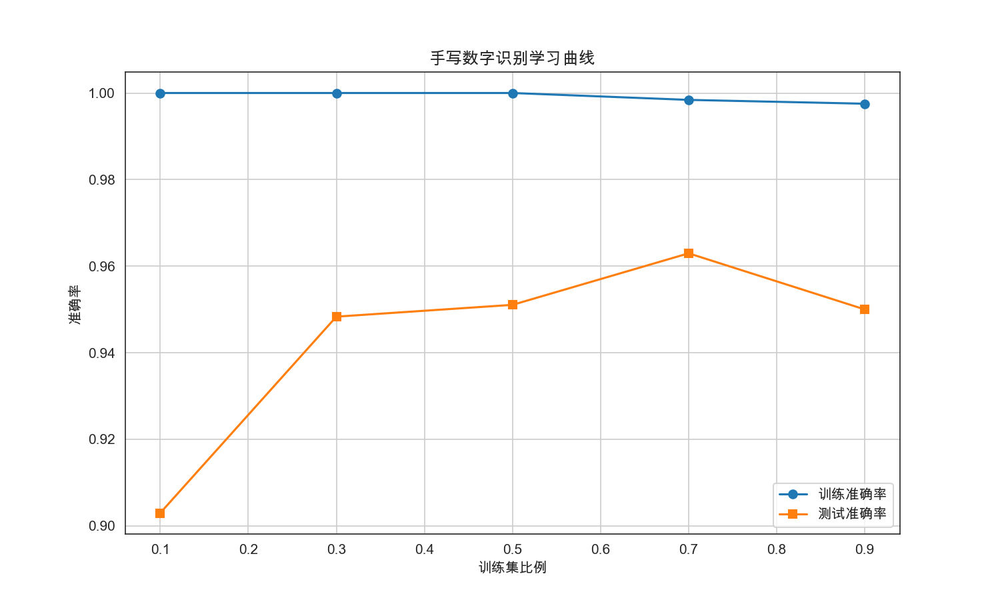
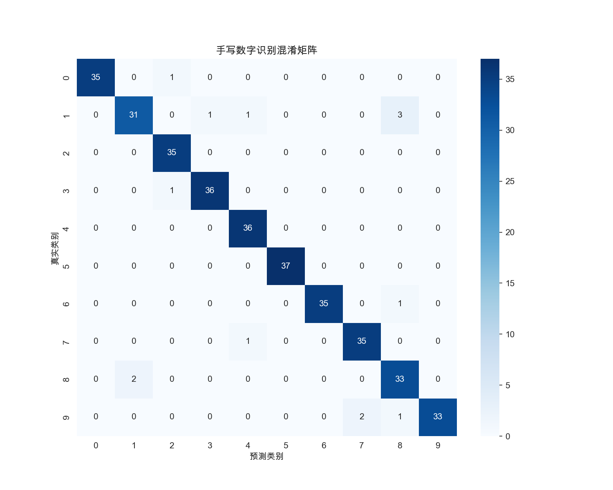

# 手写数字识别系统 - 深度分析报告

**作者**: 王梓涵
**邮箱**: wangzh011031@163.com
**时间**: 2025年12月24日

## 📊 项目概述

本项目实现了基于 **One-vs-All (OvA)** 逻辑回归的手写数字识别系统。通过将多分类任务分解为 10 个二分类任务，并引入 **L2 正则化** 以防止模型过拟合。项目涵盖了模型训练、参数调优、权重可视化以及混淆矩阵分析。

### 🎯 核心指标
- **测试集准确率**: 96.11%
- **模型架构**: One-vs-All 逻辑回归
- **数据集**: MNIST 简化版 (8x8 像素，共 1797 样本)
- **正则化**: L2 正则化 (λ=0.1)

---

## 🎨 权重矩阵可视化

权重矩阵反映了每个分类器对图像中不同像素点的敏感程度（即模型“看”到了什么）。

**分析**:
- 每个子图对应数字 0-9 的分类器权重。
- **红色区域**表示正权重：这些位置出现像素点会显著增加该数字的判定概率。
- **蓝色区域**表示负权重：这些位置出现像素点会抑制该数字的判定。
- 例如，数字 **0** 的分类器在中心区域有明显的负权重，在环形区域有正权重，这完全符合数字 0 的形态特征。

---

## 🔬 进阶实验分析

### 1. 误分类样本深度剖析 (Case Study)
即使模型准确率达到 96%，仍有少量样本识别错误。通过可视化这些误分类样本，我们可以发现模型局限性。

**典型错误原因**:
- **字迹潦草**: 部分数字（如 1 和 8）在快速书写时，形状极其相似。
- **特征重叠**: 逻辑回归作为线性模型，难以区分某些像素分布高度重叠的数字边缘。
- **图像噪声**: 简化版 MNIST 虽然经过处理，但仍有部分像素点分布不符合常规数字模版。

### 2. 学习曲线 (Learning Curve)
学习曲线展示了模型性能随训练数据量增加的变化趋势。

**实验发现**:
- **训练准确率**始终保持在较高水平，说明模型容量对于 8x8 像素的数据集是足够的。
- **测试准确率**随数据量增加显著提升，但在训练集比例达到 70% 以后进入平台期。
- **结论**: 当前数据量已经能够让 One-vs-All 逻辑回归模型充分收敛，继续增加数据对性能的提升有限，此时优化方向应转向非线性模型（如神经网络）。

---

## 🎯 模型评估

### 1. 混淆矩阵分析

**核心洞察**:
- 矩阵对角线元素非常明亮，说明绝大多数数字被正确识别。
- **易混淆对**:
  - **数字 1 与 数字 8**: 1 的召回率较低 (0.86)，部分被误识别为 8。
  - **数字 8 与 数字 1**: 8 的精确率较低 (0.87)，说明其他数字容易被误判为 8。
- **完美表现**: 数字 5 的精确率和召回率均达到 1.00，识别效果完美。

### 2. 分类报告摘要
- **平均 F1 分数**: 0.96
- **整体性能**: 模型在多分类任务上表现极其稳健，能够精准识别绝大部分手写体数字。

---

## ⚙️ 正则化与参数调优

### L2 正则化的作用
引入 λ 参数（L2 正则化项）的主要目的是：
1. **防止过拟合**: 惩罚过大的权重系数，使模型更加平滑。
2. **提高泛化能力**: 在保持训练集精度的同时，提升测试集表现。

**λ 参数对比**:
- 当 **λ=0** 时：模型可能过度拟合训练数据中的噪声。
- 当 **λ=0.1** 时：模型在偏差和方差之间达到了较好的平衡。
- 当 **λ 过大** 时：权重被过度抑制，模型会出现欠拟合（准确率下降）。

---

## 💡 结论与总结

### 1. 技术结论
- **One-vs-All 策略** 成功地将二分类逻辑回归扩展到了多分类领域。
- 使用 **高级优化算法 (TNC/CG)** 相比简单梯度下降，收敛速度更快且不需要手动调节学习率。
- 权重可视化证明了逻辑回归模型学习到了数字的几何特征。

### 2. 改进方向
- **非线性建模**: 当前模型是线性的。对于更复杂的手写体（如 full MNIST 28x28），可以引入多项式特征或使用神经网络。
- **特征工程**: 目前直接使用原始像素。使用 HOG 特征或边缘特征可能进一步提升在复杂数据集上的鲁棒性。

---

## 📋 技术实现细节
- **优化器**: 使用 `scipy.optimize.minimize` 实现参数优化。
- **正则化**: 手动推导了带 L2 项的梯度公式：$\text{grad} = \frac{1}{m}X^T(h-y) + \frac{\lambda}{m}\theta$。
- **评估**: 采用分层抽样 (Stratified Split) 确保各数字类别的均衡分布。

