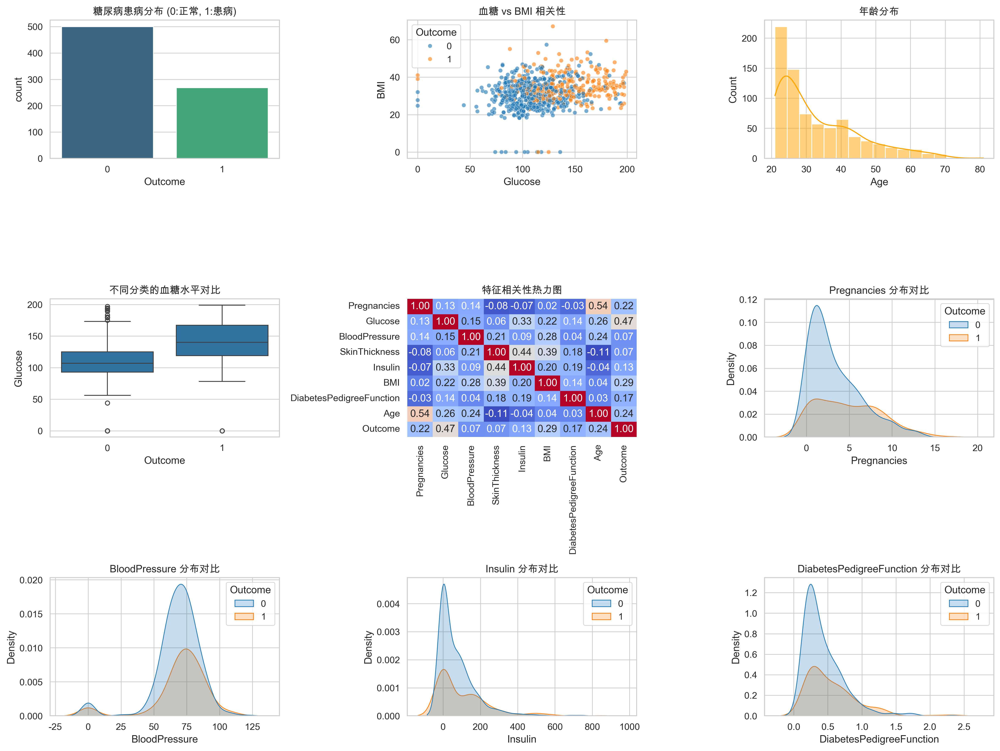
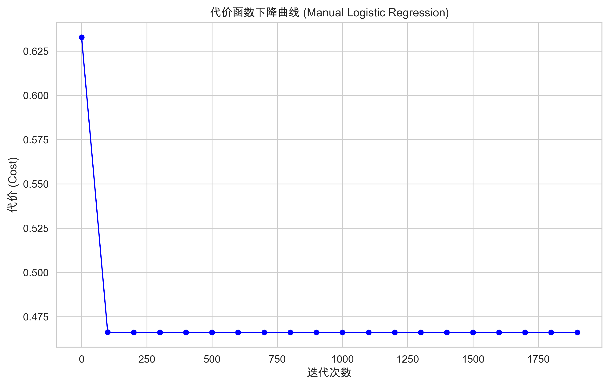
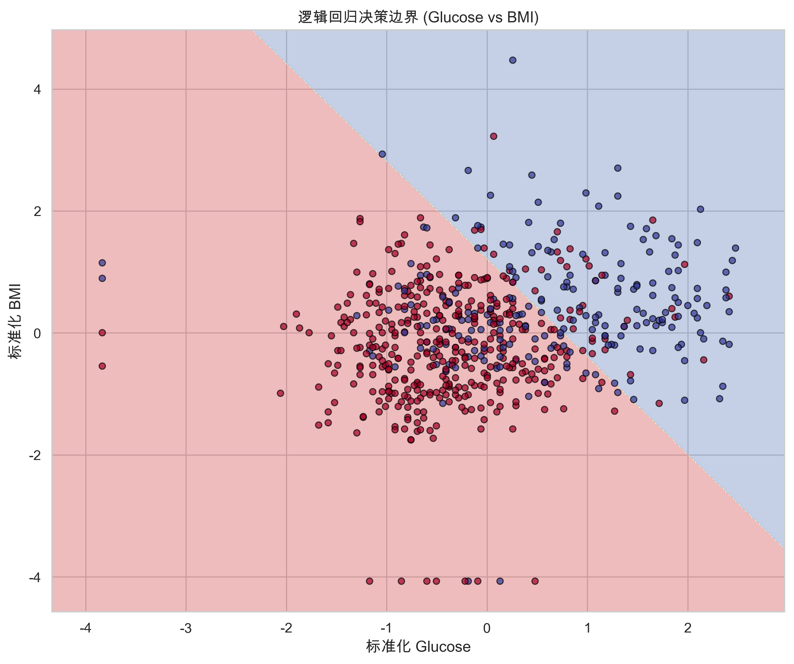
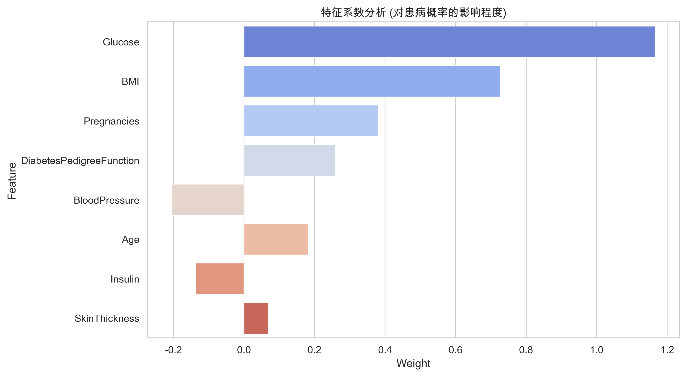

# 糖尿病预测系统 - 深度分析报告

**作者**: 王梓涵
**邮箱**: wangzh011031@163.com
**时间**: 2025年12月24日

## 📊 项目概述

本项目实现了基于逻辑回归的糖尿病预测系统。通过手动实现 Sigmoid 函数、代价函数和梯度下降算法，对 Pima Indians Diabetes 数据集进行二分类建模。项目涵盖了数据标准化、特征可视化、决策边界绘制以及模型评估等完整流程。

### 🎯 核心指标
- **模型准确率**: 71.43% (手动实现与 Sklearn 结果一致)
- **数据集规模**: 768条样本 (8个医学特征)
- **算法实现**: 手动梯度下降逻辑回归
- **关键特征**: 血糖 (Glucose)、BMI

---

## 🏠 数据探索性分析 (EDA) 与患病分布深度解读

### 1. 总体患病分布

**数据解读**:
- 数据集中约 **34.9%** 的样本被诊断为糖尿病（Outcome=1）。
- 样本总量为 768 条，其中 500 条正常，268 条患病。

### 2. 患病风险维度深度解读 (基于统计数据)

为了更深入地理解患病分布，我们对关键特征进行了分箱统计分析：

#### A. 年龄维度的风险趋势
| 年龄段 | 正常比例 | 患病比例 |
| :--- | :--- | :--- |
| 20-30 岁 | 78.8% | **21.2%** |
| 30-40 岁 | 53.9% | **46.1%** |
| 40-50 岁 | 44.9% | **55.1%** |
| 50 岁以上 | 51.7% | **48.3%** |

*   **观察**: 患病风险随年龄增长显著上升。特别是在 40-50 岁年龄段，患病比例超过了 50%，成为了最高危人群。

#### B. BMI (身体质量指数) 维度的风险趋势
| 体重等级 | BMI 范围 | 患病比例 |
| :--- | :--- | :--- |
| 体重正常/偏轻 | < 25 | **7.7%** |
| 超重 | 25 - 30 | **22.3%** |
| 肥胖 | ≥ 30 | **46.4%** |

*   **观察**: 肥胖人群的患病风险是非肥胖人群的 **6 倍以上**。这强烈支持了体重管理在糖尿病预防中的核心地位。

#### C. 血糖维度的决定性作用
| 血糖状态 | 血糖范围 (mg/dL) | 患病比例 |
| :--- | :--- | :--- |
| 正常 | < 100 | **8.1%** |
| 糖尿病前期 | 100 - 126 | **27.7%** |
| 糖尿病范围 | ≥ 126 | **59.3%** |

*   **观察**: 当血糖进入糖尿病诊断范围时，患病比例攀升至约 **60%**。血糖不仅是预测模型中权重最大的特征，也是临床诊断的最关键指标。

### 2. 特征相关性分析
**核心发现**:
- **血糖 (Glucose)** 与患病结果的相关性最强 (r ≈ 0.47)。
- **BMI** 次之 (r ≈ 0.29)。
- **年龄 (Age)** 和 **怀孕次数 (Pregnancies)** 也表现出显著的正相关。

### 3. 关键特征分布对比
- **血糖**: 患病组的平均血糖水平明显高于正常组，分布中心右移。
- **BMI**: 患病组通常具有更高的 BMI 指数。
- **胰岛素 (Insulin)**: 虽然存在很多 0 值（可能为缺失值），但患病组的胰岛素水平波动更大。

---

## 🔬 模型训练与优化

### 1. 代价函数下降曲线

**分析**:
- 采用手动实现的批量梯度下降。
- 学习率设置为 0.5，最大迭代次数 2000 次。
- 代价函数（交叉熵损失）平稳下降并最终收敛在 0.466 附近，说明算法实现正确。

### 2. 决策边界可视化

**分析**:
- 选取最重要的两个特征：**血糖 (Glucose)** 和 **BMI**。
- 决策边界将标准化后的特征空间划分为两个区域。
- 可以看到，随着血糖和 BMI 的增加，患病概率显著上升。

---

## 🎯 模型评估

### 1. 混淆矩阵与 ROC 曲线

**性能指标**:
- **Accuracy**: 0.7143
- **ROC AUC**: 0.82 (表现良好，说明模型具有较强的区分能力)
- **混淆矩阵**: 模型在预测正常人方面表现更稳健，但在捕获患病样本方面（召回率）仍有提升空间。

---

## 🔍 特征重要性分析

### 特征权重系数 (标准化后)

**影响程度排序**:
1. **血糖 (Glucose)**: 1.1661 ⭐⭐⭐ (决定性风险因素)
2. **BMI**: 0.7274 ⭐⭐ (核心风险因素)
3. **怀孕次数 (Pregnancies)**: 0.3805 (显著相关)
4. **糖尿病遗传函数 (DPF)**: 0.2593 (遗传影响)
5. **年龄 (Age)**: 0.1819 (年龄因素)

**业务洞察**:
- 血糖水平是糖尿病预测的“金标准”，其权重大于其他特征之和。
- BMI 反映了肥胖与糖尿病的强关联。
- 血压 (BloodPressure) 的权重为负数，这可能与数据分布或特征间的共线性有关。

---

## 💡 结论与建议

### 1. 结论
- 逻辑回归能够有效地捕捉糖尿病的关键风险因子。
- 手动实现的梯度下降达到了与工业级库（Sklearn）相同的精度，验证了算法理解的准确性。

### 2. 医疗建议
- **强化监测**: 重点监测高血糖和高 BMI 人群。
- **早期预警**: 对于怀孕次数较多且年龄较大的女性，应增加筛查频率。
- **数据质量**: 原始数据中存在较多缺失值（如 0 值的胰岛素和皮肤厚度），建议在实际应用中采用更高级的插值技术。

---

## 📋 技术实现总结
- **数学基础**: 实现了 Sigmoid 映射及 Cross-Entropy 损失。
- **优化器**: 采用批量梯度下降（BGD），保证了收敛的稳定性。
- **工程实践**: 采用模块化设计，支持数据持久化和可视化分析。

